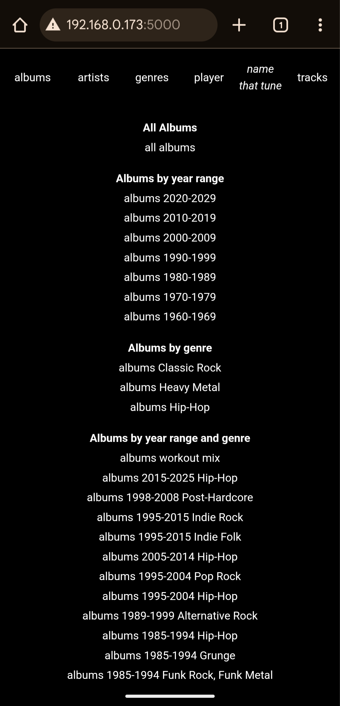
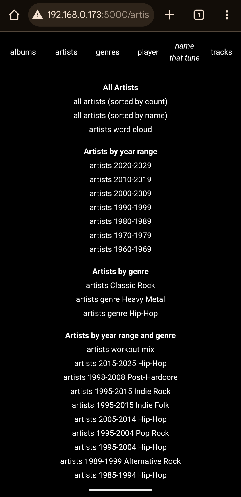
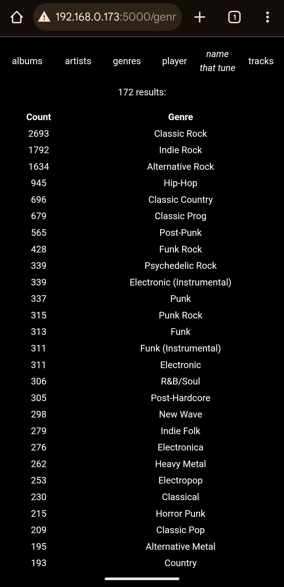
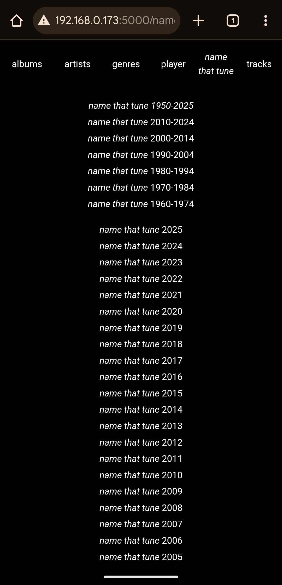
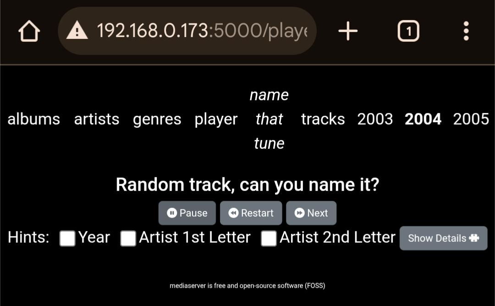
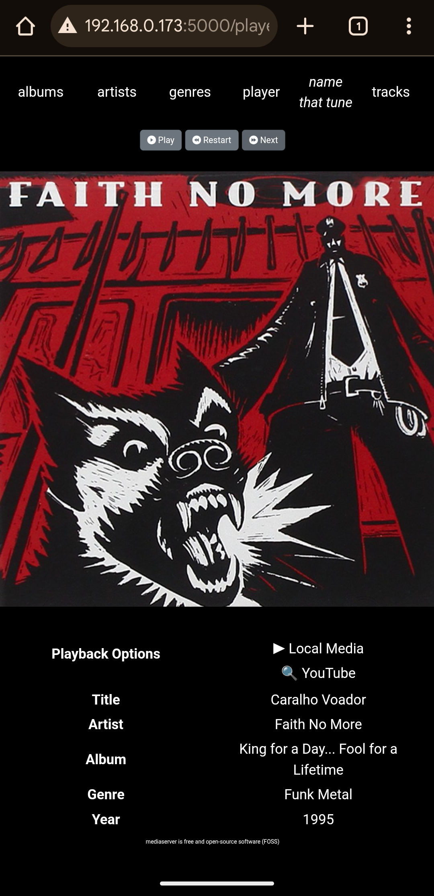
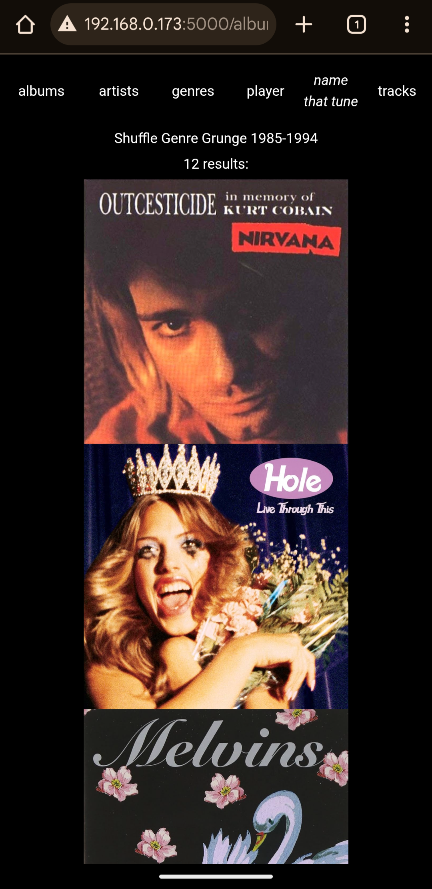

# mediaserver

A minimalist Flask web application for browsing and playing music files

Uses my other project [mediascan](https://github.com/bretttolbert/mediascan) for scanning music library files. Currently this must be performed manually (both for initial music library scan and to re-scan music library)

Development Status: Pre-Alpha

## Features

- Simple minimalist web interface, perfect for a party jukebox hosted on your home WiFi network
- Multiple playback options (configurable):
    1. Play local media files in the browser (using HTML5 `<audio>` tag)
    2. "Play" by opening YouTube search for _"(artist) (album) (title) video"_ (configurable)
    3. (Default) Display both options
- Album art displayed at a beautiful `1000x1000px` resolution
    - (bandwidth optimized by converting to `.webp` at 80% quality if hosted by yours truly)
- Continuous shuffle playback with filtering options
- Fast (tested with a library of 20,000+ music files)
- Versatile filtering and sorting via a common set of intuitive url parameters
- Comprehensive browsing options--browse by _artist_, _album_, _genre_, _year_, _year range_, and more
- _Name That Tune_--plays a song without displaying the info, but offering hints, challenging the user to name the artist/tune
- Direct download of music files via hyperlinks
- Accessible from mobile devices (tested in Chrome on Android)

## Screenshots

[Screenshots](./doc/screenshots/)
















## Limitations

- Doesn't work with some `.m4a` files (html5 audio element can't decode)
- Requires that music library be scanned with [mediascan](https://github.com/bretttolbert/mediascan) which outputs a [files.yaml](https://github.com/bretttolbert/mediascan/blob/main/out/files.yaml) file. This must be repeated to update the music library (e.g. add new files)
- Requires that music files be organized in the way that `mediascan` expects i.e. artist folders containing album folders with `cover.jpg` files
- Requires that music filenames not contain prohibited characters such as `+` (prevent by testing music library with [mediatest](https://github.com/bretttolbert/mediatest))

## Coming soon

- Play entire albums
- Playlists
- Back button to go back to previous track(s) in player
- Sort by modified time

## Dependencies

- [mediascan](https://github.com/bretttolbert/mediascan) A simple and fast Go (golang) command-line utility to recursively scan a directory for media files, extract metadata (including ID3v2 tags from both MP3 and M4A files), and save the output in a simple YAML format e.g. [files.yaml](https://github.com/bretttolbert/mediascan/blob/main/out/files.yaml), and a Python library with data classes for working with the YAML files output by `mediascan.go`.

## Quick Start

- Configure `MUSIC_LIB_PATH_PREFIX`, etc. in the [`mediaserver_config.yaml`](./mediaserver_config.yaml)

```bash
git clone git@github.com:bretttolbert/mediascan.git
cd mediascan
go run mediascan/src/mediascan.go conf/conf.yaml out/files.yaml
cd ..
git clone git@github.com:bretttolbert/mediaserver.git
cd mediaserver
python run.py mediaserver_config.yaml
```

## Player Filtered Continuous Shuffle Examples

### Filter by year range

```bash
http://localhost:5000/player?minYear=1990&maxYear=2004
```

### Filter by year range and genre(s)

```bash
http://localhost:5000/player?minYear=1960&maxYear=2024&genre=Industrial+Metal&genre=Punk&genre=Punk+Rock&genre=Heavy+Metal&genre=Hip+Hop&genre=Urbano&genre=Thrash+Metal&genre=Nu+Metal&genre=Rock+en+español&genre=Funk+Metal&genre=Hip-Hop+français
```

### Filter by artist, album and title

```bash
http://localhost:5000/player?artist=Rush&album=Grace%20Under%20Pressure&title=The%20Body%20Electric
```

## Automatically start and run as a SystemD service

- Customize the .service file [`mediaserver.service`](mediaserver.service) as required
    - Create a compatible Python virtual environment with the necessary dependencies
    - Active it and install mediaserver `python -m pip install .`
    - Update the service file to point to your virtual environment
    - Update the username and group name from `brett` to the user and group name you want to use
- Copy the .service file into the systemd system folder to install it as a systemd service
    1. `sudo bash`
    2. `cp mediaserver.service /etc/systemd/system/`
    3. `cd /etc/systemd/system`
    4. `chmod 644 mediaserver.service`
    5. `ln -s mediaserver.service ./multi-user.target-wants/mediaserver.service`
- Use the systemctl daemon-reload command to force systemd to load the mediaserver.service file
    1. `systemctl daemon-reload`
- Start the mediaservice service and use journalctl to verify that it is running
    1. `systemctl start mediaserver.service`
    2. `journalctl -u mediaserver.service`

Once you have it set up to run as a service, re-scanning your library is as easy as this:
```bash
cd ~/Git/mediascan
go run mediascan/src/mediascan.go conf/conf.yaml out/files.yaml
sudo systemctl restart mediaserver.service
journalctl -fu mediaserver.service
```
- Use `-fu` to follow the log so you can watch the server startup.


## Set Flask environment variables

I haven't found this necessary, but here's how to do it:

```bash
export FLASK_APP=run.py
export FLASK_ENV=development
```
