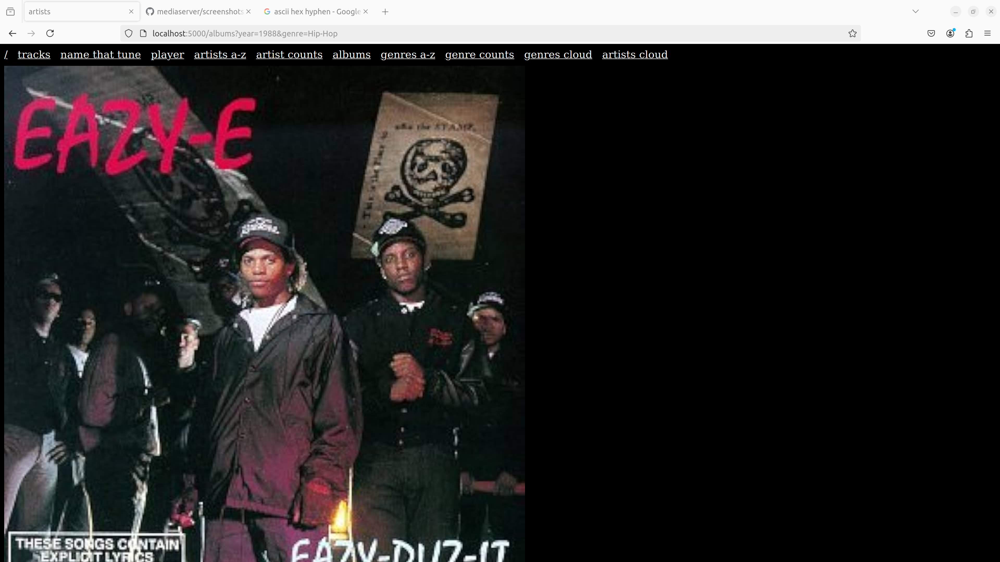

# mediaserver

A minimalist Flask web application for browsing and playing music files

Uses my other project [mediascan](https://github.com/bretttolbert/mediascan) for scanning music library files. Currently this must be performed manually (both for initial music library scan and to re-scan music library)

Development Status: Pre-Alpha

Features:
- Simple minimalist web interface, perfect for a party jukebox hosted on your home WiFi network
- Large (1000x1000px) album art display
- Continuous shuffle playback with filtering options
- Fast (tested with a library of 15,000+ music files)
- Versatile filtering and sorting via a common set of intuitive url parameters
- Comprehensive browsing options--browse by artist, album, genre, year, year range, and more
- Name That Tune--plays a song without displaying the info, but offering hints, challenging the user to name the artist/tune
- Direct download of music files via hyperlinks
- Accessible from mobile devices (tested in Chrome on Android)

[Screenshots](./screenshots/)




Limitations:
- Doesn't work with some `.m4a` files (html5 audio element can't decode)
- Requires that music library be scanned with [mediascan](https://github.com/bretttolbert/mediascan) which outputs a [files.yaml](https://github.com/bretttolbert/mediascan/blob/main/out/files.yaml) file. This must be repeated to update the music library (e.g. add new files)
- Requires that music files be organized in the way that `mediascan` expects i.e. artist folders containing album folders with `cover.jpg` files
- Requires that music filenames not contain prohibited characters such as `+` (prevent by testing music library with [mediatest](https://github.com/bretttolbert/mediatest))
- Requires that your music library path begins with `/data/`, but you can change this by modifying the variable `MUSIC_LIB_PATH_PREFIX` in `mediaserver.py` (TODO: make this configurable instead of hard-coded)

Coming soon:
- Play entire albums
- Playlists
- Back button to go back to previous track(s) in player
- Sort by modified time

## Dependencies

- [mediascan](https://github.com/bretttolbert/mediascan) A simple and fast Go (golang) command-line utility to recursively scan a directory for media files, extract metadata (including ID3v2 tags from both MP3 and M4A files), and save the output in a simple YAML format (e.g. [files.yaml](https://github.com/bretttolbert/mediascan), and a Python library with data classes for working with the YAML files output by `mediascan.go`.

## Quick Start

```bash
git clone git@github.com:bretttolbert/mediascan.git
cd mediascan
go run mediascan/src/mediascan.go conf/conf.yaml out/files.yaml
cd ..
git clone git@github.com:bretttolbert/mediaserver.git
cd mediaserver
flask --app mediaserver run --host=0.0.0.0
```

### Run in debug mode (enables logging)
```bash
flask --app mediaserver run --host=0.0.0.0 --debug
```

## Player Filtered Continuous Shuffle Examples

###### Filter by year range

```bash
http://localhost:5000/player?minYear=1990&maxYear=2004
```

###### Filter by year range and genre(s)

```bash
http://localhost:5000/player?minYear=1960&maxYear=2024&genre=Industrial+Metal&genre=Punk&genre=Punk+Rock&genre=Heavy+Metal&genre=Hip+Hop&genre=Urbano&genre=Thrash+Metal&genre=Nu+Metal&genre=Rock+en+español&genre=Funk+Metal&genre=Hip-Hop+français
```

###### Filter by artist, album and title

```bash
http://localhost:5000/player?artist=Rush&album=Grace%20Under%20Pressure&title=The%20Body%20Electric
```

###### Automatically start and run as a SystemD service

- Customize the .service file [`mediaserver.service`](mediaserver.service) as required
    - Create a compatible Python virtual environment with the necessary dependencies
    - Active it and install mediaserver `python -m pip install .`
    - Update the service file to point to your virtual environment
    - Update the username and group name from `brett` to the user and group name you want to use
- Copy the .service file into the systemd system folder to install it as a systemd service
    - `sudo bash`
    - `cp mediaserver.service /etc/systemd/system/`
    - `cd /etc/systemd/system`
    - `chmod 644 mediaserver.service`
    - `ln -s mediaserver.service ./multi-user.target-wants/mediaserver.service`
- Use the systemctl daemon-reload command to force systemd to load the mediaserver.service file
    - `systemctl daemon-reload`
- Start the mediaservice service and use journalctl to verify that it is running
    - `systemctl start mediaserver.service`
    - `journalctl -u mediaserver.service`
